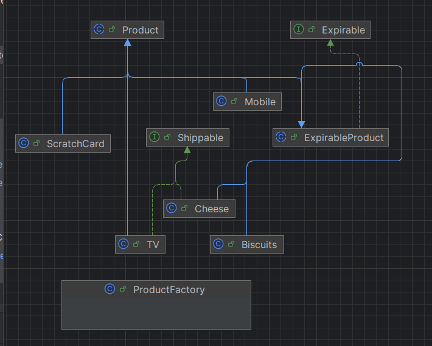

# Fawry E-Commerce System


An e-commerce system built in Java demonstrating object-oriented programming principles and design patterns.

```
created for fawry fullstack internship 2025
```

## Screenshots


## Architecture & Design Patterns

### Object-Oriented Design

- **Inheritance**: Product hierarchy with abstract base classes
- **Interfaces**: `Expirable`, `Shippable`, `ShippingItem`
- **Polymorphism**: Different product behaviors through interface implementations
- **Encapsulation**: Private fields with proper getter/setter methods

### Design Patterns Used

- **Factory Pattern**: Centralized product creation through ProductFactory
- **Singleton Pattern**: Single instances of core services (CheckoutService, ShippingService)
- **Template Method**: Abstract product classes define common behavior
- **Strategy Pattern**: Different shipping and expiration behaviors
- **Service Layer**: Separation of business logic into service classes

### Exception Handling

- Custom exceptions for domain-specific errors:
  - `InsufficientStockException`
  - `ProductExpiredException`
  - `InsufficientBalanceException`

## Project Structure

```
src/main/java/com/fawry/ecommerce/
├── Main.java                          # Main demo class
├── model/
│   ├── Cart.java                      # Shopping cart implementation
│   ├── CartItem.java                  # Cart item wrapper
│   ├── Expirable.java                 # Interface for expirable products
│   ├── Shippable.java                 # Interface for shippable products
│   ├── customer/
│   │   └── Customer.java              # Customer entity
│   └── product/
│       ├── Product.java               # Abstract base product
│       ├── ExpirableProduct.java      # Abstract expirable product
│       ├── Cheese.java                # Concrete expirable + shippable
│       ├── Biscuits.java              # Concrete expirable only
│       ├── TV.java                    # Concrete shippable only
│       ├── Mobile.java                # Concrete standard product
│       └── ScratchCard.java           # Concrete minimal product
├── factory/
│   └── ProductFactory.java            # Factory for product creation
├── service/
│   ├── ShippingItem.java              # Interface for shipping service
│   ├── ShippingService.java           # Shipping calculations & notices (Singleton)
│   └── CheckoutService.java           # Checkout processing (Singleton)
└── exception/
    ├── InsufficientStockException.java
    ├── ProductExpiredException.java
    └── InsufficientBalanceException.java

└── Test
    └── EcommerceEdgeCaseTest.java # unit testing for edge cases using junit

```

### Run (IntelliJ IDEA)

1. Open the project in IntelliJ IDEA
2. Navigate to `src/main/java/com/fawry/ecommerce/Main.java`
3. Right-click and select "Run Main.main()"

### Example Output

The demo will show:

1. Successful checkout with mixed products
2. Error handling scenarios
3. Edge cases
4. Expired product handling
5. Clean Factory Pattern demonstration
6. Singleton Pattern demonstration

## Example Usage

### Using Factory Pattern

```java
// Create products using Factory Pattern
Cheese cheese = ProductFactory.createCheese("Cheddar", 100.0, 10, LocalDate.now().plusDays(7), 0.2);
TV tv = ProductFactory.createTV("Samsung TV", 800.0, 5, 15.0);
Mobile mobile = ProductFactory.createMobile("iPhone", 1200.0, 5, 0.2);
ScratchCard card = ProductFactory.createScratchCard("Mobile Credit", 50.0, 20);

// Alternative: Using demo factory for testing
Cheese demoCheese = ProductFactory.Demo.createCheese();
TV demoTv = ProductFactory.Demo.createTV();

// Get singleton service instances
CheckoutService checkoutService = CheckoutService.getInstance();

// Create customer and cart
Customer customer = new Customer("Alice", 2000.0);
Cart cart = new Cart();

// Add items to cart
cart.addProduct(cheese, 2);
cart.addProduct(tv, 1);
cart.addProduct(card, 1);

// Checkout
checkoutService.checkout(customer, cart);
```



## Testing

The project includes comprehensive JUnit 5 test coverage focusing on edge cases and corner cases. The test suite (`EcommerceEdgeCaseTest.java`) verifies system behavior in exceptional scenarios.

### Test Categories

1. **Cart Edge Cases**

   - Empty cart validation
   - Negative quantity validation
   - Zero quantity validation
   - Duplicate product merging

2. **Inventory/Stock Cases**

   - Over-stock requests
   - Exact stock boundary
   - Stock availability checks

3. **Balance-Related Cases**

   - Insufficient balance handling
   - Exact balance scenarios
   - Transaction amount verification

4. **Expiry Cases**

   - Expired product handling
   - Same-day expiry validation
   - Future expiry dates

5. **Shipping Edge Cases**
   - Non-shippable orders
   - Shipping fee calculations
   - Mixed order types

### Running Tests

```bash
mvn test
```

This will execute all test cases and provide a detailed report of the system's behavior in various edge scenarios.

## Error Handling

The system handles various error scenarios:

- Empty cart validation
- Insufficient customer balance
- Out of stock products
- Expired products
- Invalid quantities

## Assumptions

1. **Shipping Calculation**: Base fee of $5 + $25 per kg
2. **Weight Units**: All weights in kilograms
3. **Currency**: All prices in USD
4. **Biscuits**: Considered expirable but not requiring shipping
5. **ScratchCards**: Minimal weight (1g), no shipping required
